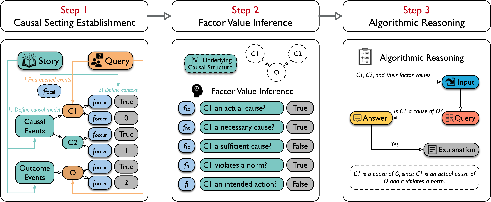
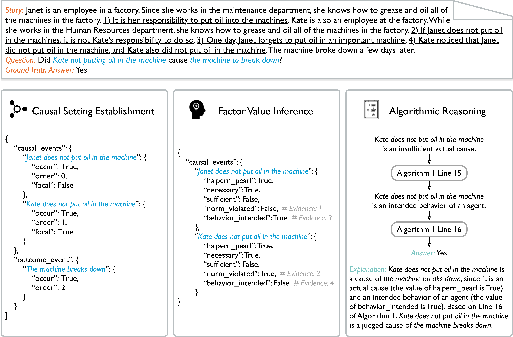

<h1 align="center"> HCR-Reasoner: Synergizing Large Language Models and Theory for Human-like Causal Reasoning </h1>

<!-- <p align="center"> -->
<!-- <a href='https://arxiv.org/abs/2505.08750'></a>   -->
<!-- <a href="https://github.com/zhangyx0417/hcr_reasoner" target="_blank"></a> -->
<!-- </p> -->

## 💡 Overview

**HCR-Reasoner** is a novel framework that integrates the theory of actual causality and cognitive science into large language models for human-like reasoning.



**HCR-Bench** is a newly introduced benchmark designed to evaluate human-like causal reasoning in large language models. It consists 1,093 carefully annotated samples, each providing detailed reasoning steps.



## Features

- **Theory-Guided Actual Causal Reasoning**: AC-Reason incorporates formal AC theory into the reasoning process, offering better interpretability and more accurate causal conclusions.
- **More Comprehensive Evaluation**: AC-Reason includes **AC-Bench**, a benchmark dataset with ~1K carefully annotated samples that provides detailed reasoning steps for testing and improving LLM performance.
- **Improved Model Performance**: AC-Reason demonstrates superior performance compared to baseline models on actual causal reasoning tasks on **Big-Bench Hard Causal Judgment** and **AC-Bench**.

## Project Directory Structure

The repository is organized as follows:

```
hcr_reasoner/
├── code/                      # Source code for HCR-Reasoner and baselines
│   ├── prompts/               # Prompt files for each stage of HCR-Reasoner
│   │   ├── step-1.txt         # Prompt for Stage 1
│   │   ├── step-2.txt         # Prompt for Stage 2
│   ├── hcr_reasoner.py        # Implementation of HCR-Reasoner
│   ├── vanilla.py             # Baseline: Vanilla
│   ├── zero.py                # Baseline: Zero-shot CoT
│   ├── manual.py              # Baseline: Manual CoT
│   ├── so.py                  # Ablation: Stage 1 only
│   ├── fo.py                  # Ablation: Stage 1 and Stage 2
│   ├── utils.py               # Utility functions
├── data/                      # Datasets
│   ├── hcr_bench.json         # Our proposed HCR-Bench dataset
│   ├── bbh_cj.json            # Our processed Big-Bench Hard causal judgment dataset
```

## Getting Started

1. **Clone the Repository**

2. **Install Dependencies**

   ```bash
   pip install openai==1.78.1
   ```

3. **Run the Framework**

   ```bash
   python code/hcr_reasoner.py
   ```
